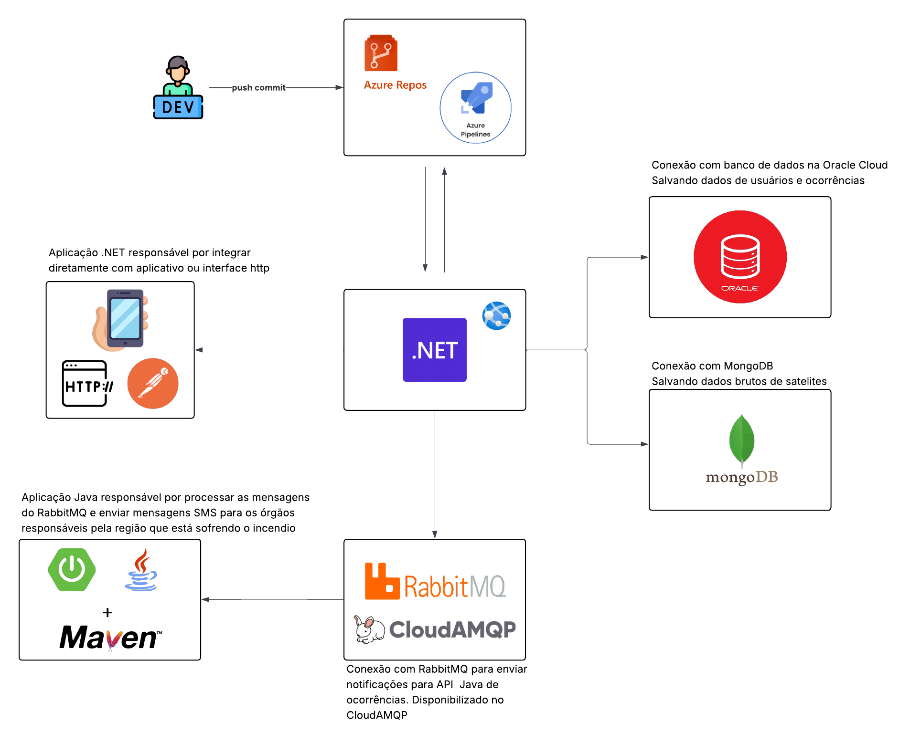

# 🌍 EcoWatch API (Projeto FireShield) - Global Solution FIAP

> **Status do Projeto:** Release Candidate (Integração de IA, Mensageria Assíncrona e Persistência Híbrida concluídas)

O **EcoWatch** é a espinha dorsal de um ecossistema B2G/Ambiental de monitoramento focado no combate e prevenção de incêndios florestais. Esta API RESTful em .NET 8 atua como o backend central, responsável por orquestrar denúncias de usuários via aplicativo, ingerir telemetria processada por Inteligência Artificial (Visão Computacional) e distribuir eventos críticos de forma assíncrona.

## 👥 Equipe Desenvolvedora

-   **Daniel Santana Correa Batista** - RM 559622
    
-   **Jonas de Jesus Campos de Oliveira** - RM 561144
    
-   **Wendell Nascimento Dourado** - RM 559336
    

## 🏗️ Arquitetura e Decisões Técnicas

O projeto foi construído focando em alta disponibilidade, observabilidade e escalabilidade, seguindo os princípios da **Clean Architecture** e dividindo as responsabilidades de persistência e mensageria:

-   **Dados Relacionais (Oracle Cloud ADB):** Utilizado para dados estruturados com forte necessidade de integridade referencial (Usuários, Ocorrências confirmadas).
    
-   **Dados Não-Estruturados (MongoDB Atlas):** Adotado para a ingestão de telemetria bruta e imagens de satélite/drones. A flexibilidade do NoSQL garante resiliência contra mudanças de formato de payload de hardware.
    
-   **Mensageria Assíncrona (RabbitMQ):** Implementa o padrão de arquitetura orientada a eventos (EDA). Imagens pesadas são enviadas à fila, processadas por um Worker Python (YOLOv8) em background, liberando o cliente (Dashboard) de bloqueios de I/O.
    
-   **Service Account Pattern:** O ecossistema possui um "Bot" autônomo (`ia-satelite@ecowatch.com`). Quando a IA detecta um incêndio, a API .NET atrela a ocorrência a esta conta de serviço no Oracle, garantindo auditoria e integridade da chave estrangeira (FK) sem depender de intervenção humana.
    
-   **Observabilidade Global:** Tratamento centralizado de exceções via `IExceptionHandler` (evitando vazamento de stack trace) e endpoint consolidado de _Health Checks_ para os bancos e mensageria.

---

## Diagrama de arquitetura



---

## API Docs

#### Swagger

```
https://app-fire-shield.azurewebsites.net/swagger/index.html
```

#### Collection Postman

[EcoWatch API Postman Collection](./EcoWatch%20API.postman_collection.json)

## 🚀 Tecnologias Utilizadas

-   **Framework:** C# / .NET 8 (Web API)
    
-   **Design Pattern:** Clean Architecture, Repository, Dependency Injection
    
-   **ORM:** Entity Framework Core 8
    
-   **Bancos de Dados:** Oracle Autonomous Database e MongoDB Atlas
    
-   **Mensageria:** RabbitMQ.Client v6.8.1 (Síncrono/Estável) via CloudAMQP
    
-   **Segurança:** Autenticação JWT (JSON Web Tokens) com BCrypt
    
-   **Monitoramento:** AspNetCore.HealthChecks v8.0.x
    
-   **Testes:** xUnit, Moq, FluentAssertions, EF Core InMemory
    
-   **Infraestrutura:** Docker & Docker Compose
    

## 📋 Pré-requisitos e Configuração de Ambiente

Este projeto não armazena credenciais em arquivos `appsettings.json` para evitar exposição no controle de versão.

1.  SDK do [.NET 8.0](https://dotnet.microsoft.com/download/dotnet/8.0) instalado.
    
2.  Na raiz do projeto, execute o script de provisionamento de senhas (`setup-secrets.sh`) para injetar as credenciais locais via `.NET Secret Manager`.
    

Bash

```
chmod +x setup-secrets.sh
./setup-secrets.sh

```

## 🏃‍♂️ Como Executar

### Opção 1: Via Docker (Recomendado para Ecossistema Completo)

Na raiz do ecossistema (onde está o `docker-compose.yml`):

Bash

```
docker-compose up -d --build ecowatch-api

```

### Opção 2: Localmente via CLI (.NET)

Bash

```
# 1. Restaurar pacotes
dotnet restore

# 2. Aplicar Migrations no Oracle
dotnet ef database update --project EcoWatch.Infrastructure --startup-project EcoWatch.Api

# 3. Rodar a Aplicação
dotnet run --project EcoWatch.Api

```

A API interativa (Swagger) estará em: `http://localhost:5015/swagger` (ou porta configurada).

## Visão Geral dos Endpoints

| Método | Rota                           | Descrição                                                                 | Requer Auth   |
|--------|--------------------------------|---------------------------------------------------------------------------|---------------|
| POST   | `/api/auth/registrar`          | Registra um novo usuário com senha criptografada (BCrypt).                | ❌ Não        |
| POST   | `/api/auth/login`              | Autentica um usuário e retorna o Token JWT.                               | ❌ Não        |
| GET    | `/api/usuarios/meu-perfil`     | Retorna os dados e estatísticas do usuário logado.                        | ✅ Sim        |
| PUT    | `/api/usuarios/editar-perfil`  | Atualiza as informações (nome, localidade, raio de alerta) do perfil.     | ✅ Sim        |
| GET    | `/api/ocorrencias`             | Lista ocorrências de incêndio reportadas.                                 | ✅ Sim        |
| POST   | `/api/ocorrencias`             | Registra nova ocorrência e publica evento no RabbitMQ.                    | ✅ Sim        |
| DELETE | `/api/ocorrencias/{id}`        | Remove uma ocorrência (apenas se pertencer ao usuário logado).            | ✅ Sim        |
| GET    | `/api/notificacoes`            | Calcula e lista alertas de incêndio próximos à localização atual.         | ✅ Sim        |
| POST   | `/api/satelites/telemetria`    | Ingestão dinâmica de dados brutos (imagem base64) para o MongoDB.         | ✅ Sim        |
| GET    | `/health`                      | Relatório de status da infraestrutura (Oracle, Mongo, Fila RabbitMQ).     | ❌ Não        |

### Observação sobre a rota `/api/ocorrencias/satelite`

Note que esta rota (específica para o Webhook B2G da sua Inteligência Artificial) não aparece na tabela acima pois ela utiliza a **ApiKeyAuth** (identificada pela chave 🔑) em vez do JWT padrão. Caso precise adicioná-la, ela seria:

| Método | Rota                           | Descrição                                                                 | Requer Auth   |
|--------|--------------------------------|---------------------------------------------------------------------------|---------------|
| POST   | `/api/ocorrencias/satelite`    | Webhook B2G: Ingestão de foco validado por IA, usando Service Account.    | 🔑 API Key    |

## 🧪 Testes Automatizados

A suíte de testes unitários foca nas regras de negócio e na orquestração de endpoints utilizando o padrão AAA (Arrange, Act, Assert).

-   **Moq:** Simulação do `IMessageBusService` para evitar publicação acidental de eventos em filas de produção durante CI/CD.
    
-   **EF Core InMemory:** Criação de bancos de dados voláteis por teste, garantindo a integridade dos cenários simulados.
    

**Para executar:**

Bash

```
dotnet test

```

## 🎥 Entregáveis em Vídeo (Global Solution)

-   🖥️ **Vídeo Demonstração (8 min):** [Insira o Link do YouTube Aqui]
    
-   🚀 **Vídeo Pitch (3 min):** [Insira o Link do YouTube Aqui]
